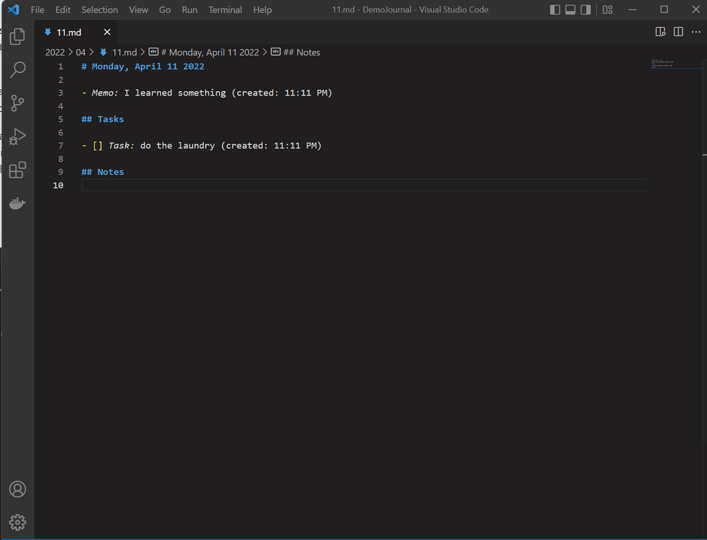

# Working with notes

Notes are single markdown files linked to the today's journal entry. `journal:note` (in the command palette using the shortcut `Ctrl+Shift+P`) opens a dialog to enter the title of a new page for notes. The title is also the filename (stored typically as subfolder in the journal structure, e.g. folder ´25´ in folder ´10´ if today is 10/25).  Local links are automatically added to the current day's journal entry.

(soon) You can also use the journal's smart input to create a note. Press `Ctrl+Shift+J` and prefix your text with the flag `note`. It will then create a new page using the remaining text in the input as title. 

Notes are automatically linked in the according journal entry (of the same day, when the note has been created).

## (soon) Scopes
Journal notes can be scoped using tags. If you enter something like "#projectA Workshop Minutes" as title, the new document will be stored not within in the base directory configured for this scope. 
