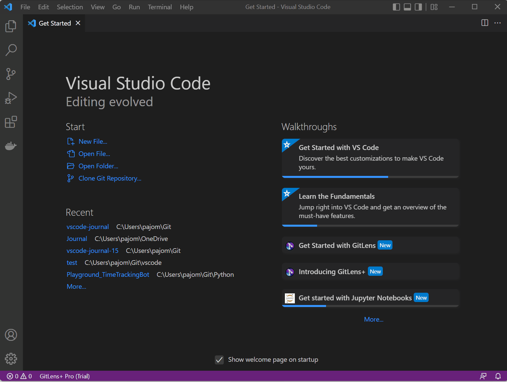

# Journal Configuration

Many parameters of the journal can be configured through the internal settings of Visual Studio Code. See [this page](https://code.visualstudio.com/docs/getstarted/settings) for a general introduction. 

The only mandatory setting is the base path. See bottom of this page for a screen capture showing how to change it. 


Before you change a setting, think about whether you want to store them in your user settings or workspace settings. 
* If your current workspace is synced across different devices and you want the setting to be used on different machines (e.g. syntax highlighting and templates), put the options into your workspace settings. 
* If the settings are specific to your environment (e.g. directories), put them into your user settings (which are stored in your local user profile)  

Some of the options support some of the following variables: 
* `${homeDir}` - the path of the current user's home directory using `os.homedir()` from NodeJS. Supports Windows, Linux and Apple environments.
* `${input}` - a string which has been entered by the user
* `${year}` - current year as number
* `${month}` - current month as number
* `${day}` - current day as number
* `${weekday}` - name of current day of week
* `${localDate}` - local display of date (([Moment.js](https://momentjs.com/docs/#/displaying/format/) format: `LL`), e.g. `September 4, 1986` 
* `${localTime}` - local display of time  ([Moment.js](https://momentjs.com/docs/#/displaying/format/) format: `LT`), e.g. `8:30 PM`
 * `${d:...}` - a custom format using the display format of [Moment.js](https://momentjs.com/docs/#/displaying/format/), for example `${d:dddd, MMMM Do YYYY}`


## Directories

### Base directory 
* Key: `journal.base`
* Default value:  Directory `Journal` in current user's home directory. 
* Supported variables: `${homeDir}` 

### Path Patterns for notes and journal entries
* Key: `journal.patterns`
* Supported variables: `${base}`, `${year}`, `${month}`, `${day}`, `${ext}`

The location of all files created within the base directory are configured using individual patterns: 

```json
"notes": {
    "path": "${base}/${year}/${month}/${day}",
    "file": "${input}.${ext}"
},
"entries": {
    "path": "${base}/${year}/${month}",
    "file": "${day}.${ext}"
}
```

This would store the entry for 22nd August 2018 in the folder `2018\08\22.md` and a note `My Note` in the folder `2018\08\22\My_Note.md`. This configuration is only valid for the default scope. Scoped notes (i.e. a scoped tag has been used during creation) would be store in another location (if configured as such). 


## Templates
Templates are used to configure, how text within the generated files is formatted. 

* Key: `journal.templates`


*Note:* in an upcoming release this is planned to be migrated to snippets

The default is configured like this: 

````json
"journal.templates": [

        {
            "name": "memo",
            "template": "- Memo: ${input} (created: ${localTime}) "
        },
        {
            "name": "task",
            "template": "- [] Task: ${input} (created: ${localTime})",
            "after": "## Tasks"
        }
        {
            "name": "entry",
            "template": "# ${d:dddd, MMMM DD YYYY}\n\n## Tasks\n\n## Notes\n\n"
        },
        {
            "name": "time",
            "template": "${localTime}"
        },
        {
            "name": "note",
            "template": "# ${input}\n\n${tags}\n"
        },
        {
            "name": "files",
            "template": "- NOTE: [${title}](${link})", 
            "after": "## Notes"

        }
    ],
````

### Template Entries
* Key: `journal.templates["note"].entry`
* Supported variables:  `${year}`, `${month}`, `${day}`, `${ext}`, `${weekday}`, `${localDate}`, `${localTime}`, `${d:}` (custom)

The above configuration will generate the following markdown. 
```markdown
# Tuesday, September 25, 2018

## Tasks

## Notes
```

If you want to change the title format and add a new header for Memos, you need to change the following parts: 


````json
"journal.templates": [

        {
            "name": "memo",
            "template": "- Memo: ${input} (created: ${localTime})", 
            "after": "## Memos"
        },
        {
            "name": "entry",
            "template": "# ${d:dddd, MMMM DD YYYY}\n\n## Tasks\n\n## Memos \n\n## Notes\n\n"
        }
    ],
````

Make sure the value in "after" matches the generated markdown section in the entry template (`'## Memos'`)


### Notes
* Key: `journal.templates["note"].template`
* Supported variables:  `${input}, ${year}`, `${month}`, `${day}`, `${weekday}`, `${localDate}`, `${localTime}`, `${d:}` (custom)

### Memos
* Key: `journal.templates["memo"].template`
* Default value:  `# - Memo: ${input}`
* Supported variables:  `${input}, ${year}`, `${month}`, `${day}`, `${weekday}`, `${localDate}`, `${localTime}`, `${d:}` (custom)
---
* Key: `journal.templates["memo"].after`
* Default value:  none (placing the value after the header)
* Supported variables:  none

The `after`-flag instructs the extensions, where to place the string in an existing entry. It will search for the string configured here, and places the new string directly afterwards. This string should be part of the template. 


### Tasks
* Key: `journal.templates["task"].template`
* Default value:  `# - [ ] Task: ${input}`
* Supported variables:  `${input}, ${year}`, `${month}`, `${day}`, `${weekday}`, `${localDate}`, `${localTime}`, `${d:}` (custom)
---
* Key: `journal.templates["task"].after`
* Default value:  `## Tasks` 
* Supported variables:  none


### File Links
* Key: `journal.templates["files"].template`
* Default value:  `- NOTE: [${title}](${link})`
* Supported variables:  
   * `${title}` - title of linked file (extraced from file name)
   * `${link}` - relative link to the file
---
* Key: `journal.templates["files"].after`
* Default value:  `## Notes` 
* Supported variables:  none

## Syntax highlighting
On the first start with the extension, defaults will be written into your user settings. You can adapt the colors if you want. 

The settings are updated only if they are not present. If you switch between light and dark themes, simply delete the journal color customizations. On the next start, the appropriate color configuraiton will be inserted into your user settings. 

## Scopes
* Key: `journal.scopes`
* Default value:  none
* Supported variables: see individual keys

Scopes allow for adapting nearly all configuration patterns for configured *tags*. By entering a scoped tag in an input tag (for entries as well as for notes), the extension uses the scope-specific configuration instead of the default settings. 

See more details [here](./scopes.md)


## Other optiones

### File extension
* Key: `journal.ext`
* Default value:  `md` for MarkDown
* Supported variables: none 

### Locale
* Key: `journal.locale`
* Default value:  `en-US` 
* Supported variables: none

### Development mode
* Key: `journal.dev`
* Default value:  false
* Supported variables: none

Depending on the version this setting might activate certain new features. In general it will produce far more detailed logs, which might be needed for error analysis. 


### Split Pane Mode
* Key: `journal.openInNewEditorGroup`
* Default value:  false
* Supported variables: none

Controls if new files are created in full mode or in a new editor group (split pane). 


